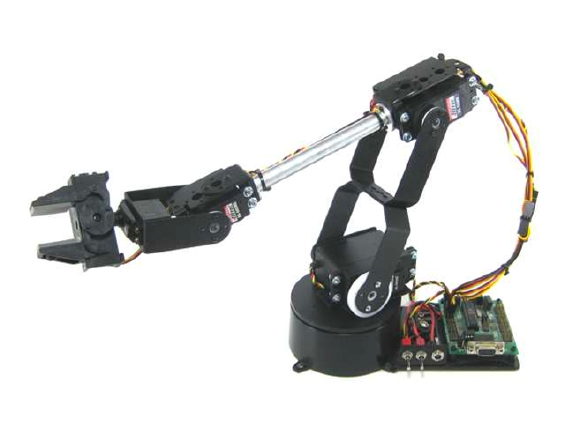
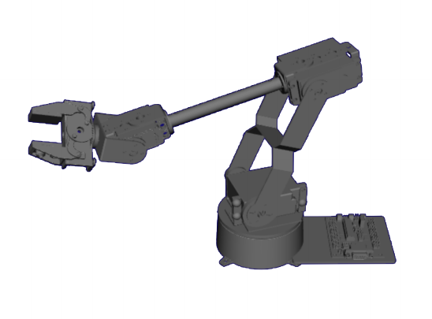

# The Lynxmotion AL5D robotic arm simulator
This package exposes a simulated version of the [Lynxmotion AL5D robot arm](http://www.lynxmotion.com/c-130-al5d.aspx) that can be used for various simulations exercises. The developed robot model has been implemented by reproducing as accurately as possible, the physical properties as well as the kinematics of the physical robot. The current package provides all the tools to visualize the robot in [Rviz](https://github.com/ros-visualization/rviz) and run a simulation in [Gazebo](http://gazebosim.org/). It comes with a set of services and publishers useful to control the simulation world and ready to be integrated in any [language supported by ROS](http://wiki.ros.org/ROS/Introduction#Goals) (See [section #3](#technical-reference-documentation)).

In addition, the package provides a set of [lego bricks](https://www.lego.com/en-us/vip/vippromotions.jsp) available in red, green and blue colors for various exercises to be run using the package.

See below the two (at the left side, the physical robotic arm, at the right side, the simulated robot)

 

## Table of contents
1. [Installation](#installation)
2. [Overview of the simulated robot](#overview-of-the-simulated-robot)
3. [Technical reference documentation](#technical-reference-documentation)
    1. [Subscribed topics](#subscribed-topics)
    2. [Published topics](#published-topics)
    3. [Services](#services)
4. [Usage](#usage)
    1. [Visualization in Rviz](#visualization-in-rviz)
    2. [Running the Gazebo simulation](#running-the-gazebo-simulation)
    3. [Setting joint positions](#setting-joint-positions)
    4. [Accessing the joint states](#accessing-the-joint-states)
    5. [Accessing the captured image](#accessing-the-captured-image)
    6. [Spawning bricks](#spawning-bricks)
    7. [Accessing the pose of a brick](#accessing-the-pose-of-a-brick)
    8. [Killing bricks](#killing-bricks)
    9. [Clear the workspace](#clear-the-workspace)
    10. [Reset the workspace](#reset-the-workspace)
    11. [Teleport a brick](#teleport-a-brick)
    12. [Move to a relative pose](#move-to-a-relative-pose)
5. [How to get additional help](#how-to-get-additional-help)

### Installation
The instructions below assume that the user has a fully functional ROS Kinetic installation. In case you do not satisfy those requirements, please install the **ros-kinetic-desktop** package by following the instructions available [here](wiki.ros.org/kinetic/Installation/Ubuntu). If you are running the CRAM VM, this has been done automatically for you.

In order for this package to work properly, it is important to install the dependencies. They can be installed by copying and pasting the following commands:

``sudo sh -c 'echo "deb http://packages.osrfoundation.org/gazebo/ubuntu-stable `lsb_release -cs` main" > /etc/apt/sources.list.d/gazebo-stable.list'``
```
wget http://packages.osrfoundation.org/gazebo.key -O - | sudo apt-key add -
sudo apt-get update
sudo apt-get install ros-kinetic-joint-state-publisher ros-kinetic-joint-state-publisher-gui \
ros-kinetic-gazebo-ros-control ros-kinetic-gazebo-ros ros-kinetic-gazebo-dev ros-kinetic-gazebo-msgs \
ros-kinetic-gazebo-plugins ros-kinetic-gazebo-ros-pkgs libignition-math2-dev ros-kinetic-effort-controllers \
ros-kinetic-joint-state-controller ros-kinetic-position-controllers ros-kinetic-genpy
sudo apt-get install gazebo7
roscd
cd ../src
git clone https://github.com/roboticsgroup/roboticsgroup_gazebo_plugins.git
git clone https://github.com/cognitive-robotics-course/lynxmotion_al5d_description.git
cd ..
catkin_make
```


### Overview of the simulated robot
The robot model has been built using 3D models collected from [GrabCad](https://grabcad.com/library/al5d-robotic-arm-1) and the [Lynxmotion website](http://www.lynxmotion.com/s-5-ses-3d-models.aspx). This has allowed the model to have a very realistic look matching the physical setting. It integrates a set of 6 joints that can be controlled for achieving different goals positions and plans. The matching of the joints to the physical robot are shown below:


The range of the values acceptable by the joints are as follows:

```markdown
Joint1: [-pi; pi]
Joint2: [0; pi]
Joint3: [-pi; 0]
Joint4: [-pi/2; pi/2]
Joint5: [-pi; pi]
Gripper: [0; 0.03175 metres]
```

### Technical reference documentation
This part provides details to programmers on how to use the various tools available in the current package and extend them to their own needs. It discusses the services, published topics and subscribers available as part of the package.

#### Subscribed topics
+ `/lynxmotion_al5d/joints_positions/command` ([std\_msgs/Float64MultiArray](http://docs.ros.org/diamondback/api/std_msgs/html/msg/Float64MultiArray.html))

&nbsp;&nbsp;&nbsp;&nbsp;&nbsp;&nbsp; The joints positions specification for the Lynxmotion AL5D simulator. Publishing values to this topic will make the robot to set the joint at the specified positions. The topic expects a set of 6 values with the first five values being the angles for the Joints 1 to 5, the last one representing the distance between the two fingers of the robot gripper.

#### Published topics
+ `/lynxmotion_al5d/joint_states` ([sensor\_msgs/JointState](http://docs.ros.org/melodic/api/sensor_msgs/html/msg/JointState.html))

&nbsp;&nbsp;&nbsp;&nbsp;&nbsp;&nbsp; Returns the state of the 6 joints of the robot at a frequency of 50 Hz. JointSate.name represents the array of the names of the joints and JointState.position represents the current position of the joints.

+ `/lynxmotion_al5d/external_vision/image_raw` ([sensor\_msgs/Image](http://docs.ros.org/melodic/api/sensor_msgs/html/msg/Image.html))

&nbsp;&nbsp;&nbsp;&nbsp;&nbsp;&nbsp; Returns in the `data` field, the matrix corresponding to the image captured by the camera sensor attached to the robot.

+ `/lynxmotion_al5d/<brick name>/pose` ([lynxmotion\_al5d\_description/Pose](msg/Pose.msg))

&nbsp;&nbsp;&nbsp;&nbsp;&nbsp;&nbsp; Returns the position (x, y, z) and orientation (roll, pitch, yaw) of the brick specified. Here, roll is a rotation around the x-axis, pitch around the y-axis and yaw around the z-axis. The values returned are in metres for the position and in radians for the angles of rotation.

#### Services
+ `/lynxmotion_al5d/clear` ([std\_srvs/Empty](http://docs.ros.org/api/std_srvs/html/srv/Empty.html))

&nbsp;&nbsp;&nbsp;&nbsp;&nbsp;&nbsp; Clears the workspace by removing all the spawned bricks. Also resets the count of bricks for which a name has been generated to allow the name starting by 0.

+ `/lynxmotion_al5d/reset` ([std\_srvs/Empty](http://docs.ros.org/api/std_srvs/html/srv/Empty.html))

&nbsp;&nbsp;&nbsp;&nbsp;&nbsp;&nbsp; Calls the `clear` service and sends the robot simulator to the home position `(0 pi/2 -pi/2 0 0 0.03)`

+ `/lynxmotion_al5d/kill_brick` ([lynxmotion\_al5d\_description/KillBrick](srv/KillBrick.srv))

&nbsp;&nbsp;&nbsp;&nbsp;&nbsp;&nbsp; Removes the brick with the specified name from the workspace. Returns a boolean with the status in the `KillBrick.result` field and a message in case an error occured in the `KillBrick.status_message` field.

+ `/lynxmotion_al5d/spawn_brick` ([lynxmotion\_al5d\_description/SpawnBrick](srv/SpawnBrick.srv))

&nbsp;&nbsp;&nbsp;&nbsp;&nbsp;&nbsp; Spawns a brick of the specified color at (x, y, z) with an orientation of (roll, pitch, yaw) - resp. rotations around the x, y and z axis. It will also optionally take the name of the brick and will fail in case there is a duplicate name. In the absence of a name, one is automatically generated in the format `brick<X>` with X being a number representing the next digit available to assign a brick.

+ `/lynxmotion_al5d/<brick_name>/teleport_absolute` ([lynxmotion\_al5d\_description/TeleportAbsolute](srv/TeleportAbsolute.srv))

&nbsp;&nbsp;&nbsp;&nbsp;&nbsp;&nbsp; Teleports the brick named `brick_name` to the specified position and orientation.

+ `/lynxmotion_al5d/<brick_name>/teleport_relative` ([lynxmotion\_al5d\_description/TeleportRelative](srv/TeleportRelative.srv))

&nbsp;&nbsp;&nbsp;&nbsp;&nbsp;&nbsp; Teleports the brick named `brick_name` by applying the specified movement from the current brick position.


### Usage
This section provides practical example on how to use the various tools embedded in this package. They serve as a tutorial for beginners who wish to get started with the package as quickly as possible.

#### Visualization in Rviz
The Rviz tool allows to visualize the robot model and comes with a GUI tool to set values for the various joints attached to the robot model. To use it, you have to run the following command from a terminal.

`roslaunch lynxmotion_al5d_description al5d.launch`

This will open up a window as shown below:


Beside the Rviz window, a small window identifable by a question mark in the launch bar will also appear.

There you will see the different joints of the robot and play around to move the robot to different places. Here is a screenshot of the aforementioned window.


The slides provided can be used to see how the robot operates when various values are being sent to it.

#### Running the Gazebo simulation
One limitation of Rviz is that it is just a visualization tool and does not provide a real simulation engine where physics can be tested. Beside, no sensors can be used inside Rviz. The Gazebo simulation has been created to overcome this challenge and allow various simulation exercises to be run with the robot simulator. Running the Gazebo simulation makes it possible to perform all the actions specified in the remaining of this documentation and is done by running the following command from a terminal.

`roslaunch lynxmotion_al5d_description al5d_gazebo_control.launch`

This will open up a Gazebo with the robot spawned at the center of an empty world as seen on the image below. 


Beside opening the Gazebo window, issuing the previous command also creates a set of ROS topics for the joints and also the external camera added to the robot model. You can view the topics by running the following command in a terminal.

`rostopic list`

This will print out the list of all available topics among which you will observe some with the prefix `lynxmotion_al5d` which refers to the simulators subsribers and publishers. Among the important topics here, we have one publisher for the robot joint states (`/lynxmotion_al5d/joint_states`), another for publishing all the joint values at once (`/lynxmotion_al5d/joints_positions/command`) and a topic to access the images from the camera sensor attached to the robot.

#### Setting joint positions
The syntax for sending joint positions to the simulated robot from the command line is:

`rostopic pub -1 /lynxmotion_al5d/joints_positions/command std_msgs/Float64MultiArray "data: [<Array of the joint values for the five joints and distance between the two fingers>]"
`

For example, to send the robot the joint values for the initial/home position, we would run the following command:

`rostopic pub -1 /lynxmotion_al5d/joints_positions/command std_msgs/Float64MultiArray "data: [0, 1.57,-1.57, 0, 0, 0.03175]"`

#### Accessing the joint states

The `joint_states` publisher publishes the robot joint states at a rate of 50Hz (i.e every 2ms). In order to access the positions of the joints from the terminal, the command to run is `rostopic echo /lynxmotion_al5d/joint_states`. The command produces a verbose output so it is advised to redirect the output to a file whenever possible.

#### Accessing the captured image

To view the images captured by the external vision sensor added to the model. run the following command from a terminal. (The camera is represented by a transparent cube in the simulation world)

`rosrun rqt_image_view rqt_image_view`

In the window that appears, select the topic `/lynxmotion_al5d/external_vision/image_raw` in the dropdown to visualize the images captured by the robot. The image captured by the camera when the robot is in the  (0, 0, 0, 0, 0, 0) position is displayed below.


#### Spawning bricks

To spawn a brick a position (x, y, z) specified in metres from the center of the world and orientation (roll, pitch, yaw) specified in radians using the XYZ rotation convention (i.e roll, pitch and yaw are respectively rotations around the x, y and z axis), you should run the following command:

`rosrun lynxmotion_al5d_description spawn_brick -c <color> [-n <name> -x <x> -y <y> -z <z> -R <roll> -P <pitch> -Y <yaw>]`.

For example, the following command spawns a red brick in the middle of the camera's field of view (0, 0.170, 0) with no rotations.

`rosrun lynxmotion_al5d_description spawn_brick -c red -y 0.170`

This second example create a **blue** brick named `mybrick` at position (0.1, 0.1, 0.1) with no rotation.

`rosrun lynxmotion_al5d_description spawn_brick -n mybrick -c red -x 0.1 -y 0.1 -z 0.1`

Note: Only the color is a required parameter and the user can feel free to put the only values that are different than zero.

#### Accessing the pose of a brick

In order to get the pose of a particular brick, the syntax of the command to execute from a command line terminal is as below.

`rostopic echo /lynxmotion_al5d/<brick name>/pose`

For example, the command `rostopic echo /lynxmotion_al5d/brick1/pose` will display the position and orientation of brick1 if it exists.


#### Killing bricks

For killing a brick that is in the workspace, the command to use is:

`rosrun lynxmotion_al5d_description kill_brick <brick name>`

For instance, running `rosrun lynxmotion_al5d_description kill_brick brick1` will remove brick1 from the workspace if it is present.

#### Clear the workspace

For clearing the workspace, the following command should be run from a terminal:

`rosservice call /lynxmotion_al5d/clear`

#### Reset the workspace

For resetting the workspace, the following command should be run from a terminal:

`rosservice call /lynxmotion_al5d/reset`

#### Teleport a brick

To move a specific robot to an absolute position, the command to be executed follows the format:

`rosservice call /lynxmotion_al5d/<brick name>/teleport_absolute '{pose: {position: {x: <x>, y: <y>, z: <z>}, orientation: {roll: <roll>, pitch: <pitch>, yaw: <yaw>}}}'`

For example, the following command moves the brick1 to the position (0 0.200 0) with a 90 degrees (~1.5708 radians) rotation around the z-axis

`rosservice call /lynxmotion_al5d/brick1/teleport_absolute '{pose: {position: {x: 0, y: 0.2, z: 0}, orientation: {roll: 0, pitch: 0, yaw: 1.5708}}}'`

#### Move to a relative pose

To move a specific robot to an relative position, the command to be executed follows the format:

`rosservice call /lynxmotion_al5d/<brick name>/teleport_relative '{pose: {position: {x: <x>, y: <y>, z: <z>}, orientation: {roll: <roll>, pitch: <pitch>, yaw: <yaw>}}}'`

For example, the following command moves the `brick1` 200 millimetres (0.2 metres) away from its current position and applies a 90 degrees (~ 1.5708 radians) rotation around the z-axis as well. 

`rosservice call /lynxmotion_al5d/brick1/teleport_relative '{pose: {position: {x: 0.2, y: 0, z: 0}, orientation: {roll: 0, pitch: 0, yaw: 1.5708}}}'`

### How to get additional help

To get help or more information on the services or publishers, feel free to use the ROS internal commands `rosmsg <message type>` and `rossrv <service type>` for the messages and service types. You can also use the `rosservice info <servicename>` and `rostopic info <topic name>` for services and published topics. 

